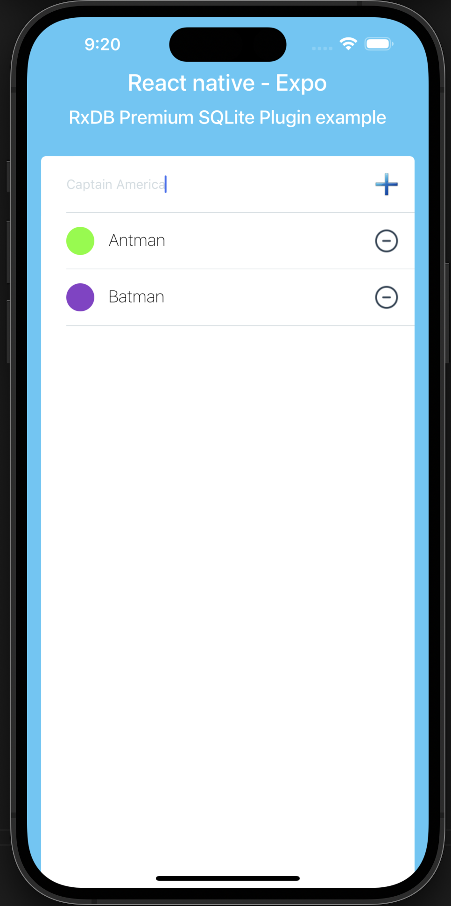
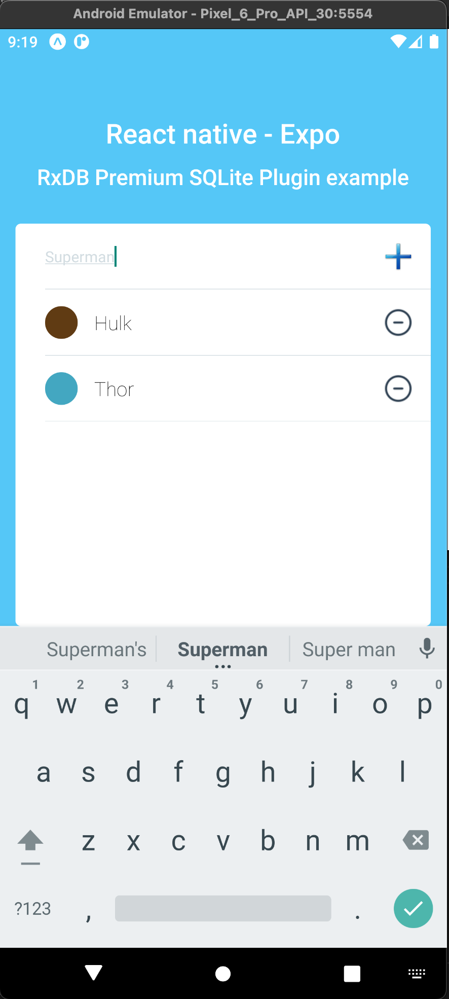

# Expo SQLite Storage

Implements the original [expo-sqlite@11.1.1](https://github.com/expo/expo/tree/main/packages/expo-sqlite) with an updated version of android.database.sqlite from [requery.sqlite-android@3.39.2](https://github.com/requery/sqlite-android) which adds support for:

- JSON1 extension
- Common Table expressions
- Indexes on expressions
- Full Text Search 5
- Generated Columns
- DROP COLUMN support

### RxDB Premium compatible

It's compatible with [RxDB](github.com/pubkey/rxdb) Premium [SQLite](https://rxdb.info/rx-storage-sqlite.html) storage:

```js
import {
  getRxStorageSQLite,
  getSQLiteBasicsExpoSQLite,
} from "rxdb-premium/plugins/storage-sqlite";
import * as ExpoSqliteStorage from "expo-sqlite-storage";
import { createRxDatabase } from "rxdb";

const storage = getRxStorageSQLite({
  sqliteBasics: getSQLiteBasicsExpoSQLite(ExpoSqliteStorage.openDatabase),
});

const db = await createRxDatabase({
  name: storage.name,
  storage,
  multiInstance: false,
  ignoreDuplicate: true,
});
```

| iOS                                                  | Android                                                  |
| :--------------------------------------------------- | :------------------------------------------------------- |
|  |  |

# Installation in managed Expo projects

For [managed](https://docs.expo.dev/versions/latest/introduction/managed-vs-bare/) Expo projects, please follow the installation instructions in the [API documentation for the latest stable release](#api-documentation). If you follow the link and there is no documentation available then this library is not yet usable within managed projects &mdash; it is likely to be included in an upcoming Expo SDK release.

# Installation in bare React Native projects

For bare React Native projects, you must ensure that you have [installed and configured the `expo` package](https://docs.expo.dev/bare/installing-expo-modules/) before continuing.

### Add the package to your npm dependencies

```
npm install expo-sqlite-storage
```

or

```
yarn add expo-sqlite-storage
```

### Configure for iOS

React-Native above 0.60:

`Run`npx pod-install` after installing the npm package.

### Configure for Android
